# RMDB 优化器模块类图

## 类图说明

本类图展示了RMDB数据库系统优化器模块的核心类及其关系，包括：
- Plan类层次结构
- Optimizer和Planner核心类
- 相关数据结构类
- 类之间的继承、组合和依赖关系

## Mermaid类图

```mermaid
classDiagram
    %% 枚举类型
    class PlanTag {
        <<enumeration>>
        T_SeqScan
        T_IndexScan
        T_NestLoop
        T_SortMergeJoin
        T_HashJoin
        T_Projection
        T_Sort
        T_Insert
        T_Delete
        T_Update
        T_CreateTable
        T_DropTable
        T_CreateIndex
        T_DropIndex
        T_Help
        T_Desc
        T_ShowTable
        T_Exit
        T_SetKnob
    }

    %% Plan基类及其子类
    class Plan {
        <<abstract>>
        +PlanTag tag
        +shared_ptr~Schema~ schema
        +Plan(PlanTag tag, shared_ptr~Schema~ schema)
        +virtual ~Plan()
    }

    class ScanPlan {
        +string tab_name
        +vector~Condition~ conds
        +SmManager* sm_manager
        +shared_ptr~Schema~ schema
        +ScanPlan(PlanTag tag, SmManager* sm_manager, string tab_name, vector~Condition~ conds, shared_ptr~Schema~ schema)
    }

    class JoinPlan {
        +shared_ptr~Plan~ left
        +shared_ptr~Plan~ right
        +vector~Condition~ conds
        +JoinPlan(PlanTag tag, shared_ptr~Plan~ left, shared_ptr~Plan~ right, vector~Condition~ conds)
    }

    class ProjectionPlan {
        +shared_ptr~Plan~ subplan
        +vector~TabCol~ sel_cols
        +shared_ptr~Schema~ schema
        +ProjectionPlan(shared_ptr~Plan~ subplan, vector~TabCol~ sel_cols, shared_ptr~Schema~ schema)
    }

    class SortPlan {
        +shared_ptr~Plan~ subplan
        +vector~TabCol~ order_cols
        +vector~bool~ is_desc
        +SortPlan(shared_ptr~Plan~ subplan, vector~TabCol~ order_cols, vector~bool~ is_desc)
    }

    class DMLPlan {
        +PlanTag tag
        +shared_ptr~Plan~ subplan
        +string tab_name
        +vector~Value~ values
        +vector~Condition~ conds
        +vector~SetClause~ set_clauses
        +SmManager* sm_manager
        +DMLPlan(PlanTag tag, shared_ptr~Plan~ subplan, string tab_name, vector~Value~ values, vector~Condition~ conds, vector~SetClause~ set_clauses, SmManager* sm_manager)
    }

    class DDLPlan {
        +PlanTag tag
        +string tab_name
        +vector~ColDef~ tab_cols
        +vector~string~ index_cols
        +SmManager* sm_manager
        +DDLPlan(PlanTag tag, string tab_name, vector~ColDef~ tab_cols, vector~string~ index_cols, SmManager* sm_manager)
    }

    class OtherPlan {
        +PlanTag tag
        +string tab_name
        +SmManager* sm_manager
        +OtherPlan(PlanTag tag, string tab_name, SmManager* sm_manager)
    }

    class SetKnobPlan {
        +string knob_name
        +string knob_value
        +SetKnobPlan(string knob_name, string knob_value)
    }

    %% Optimizer和Planner类
    class Optimizer {
        +SmManager* sm_manager
        +Optimizer(SmManager* sm_manager)
        +shared_ptr~Plan~ plan_query(shared_ptr~Query~ query, Context* context)
    }

    class Planner {
        +SmManager* sm_manager
        +Planner(SmManager* sm_manager)
        +shared_ptr~Plan~ do_planner(shared_ptr~Query~ query, Context* context)
        +shared_ptr~Plan~ generate_sort_plan(shared_ptr~Query~ query, shared_ptr~Plan~ plan)
        +shared_ptr~Plan~ generate_select_plan(shared_ptr~Query~ query, Context* context)
        +shared_ptr~Plan~ generate_insert_plan(shared_ptr~Query~ query, Context* context)
        +shared_ptr~Plan~ generate_delete_plan(shared_ptr~Query~ query, Context* context)
        +shared_ptr~Plan~ generate_update_plan(shared_ptr~Query~ query, Context* context)
        +vector~shared_ptr~Plan~~ generate_table_plans(shared_ptr~Query~ query, Context* context)
        +shared_ptr~Plan~ generate_join_plan(vector~shared_ptr~Plan~~ table_plans, shared_ptr~Query~ query)
        +shared_ptr~Plan~ pop_scan(vector~shared_ptr~Plan~~ plans, string tab_name)
        +bool check_funcs(shared_ptr~Query~ query, Context* context)
        +size_t get_indexNo(string tab_name, vector~Condition~ curr_conds)
        +Condition pop_conds(vector~Condition~ conds, string tab_name)
        +vector~Condition~ pop_conds(vector~Condition~ conds, string tab1, string tab2)
    }

    %% 数据结构类
    class Query {
        +QueryType type
        +shared_ptr~ast::Help~ help
        +shared_ptr~ast::ShowTables~ show_tables
        +shared_ptr~ast::DescTable~ desc_table
        +shared_ptr~ast::CreateTable~ create_table
        +shared_ptr~ast::DropTable~ drop_table
        +shared_ptr~ast::CreateIndex~ create_index
        +shared_ptr~ast::DropIndex~ drop_index
        +shared_ptr~ast::InsertStmt~ insert
        +shared_ptr~ast::DeleteStmt~ delete_
        +shared_ptr~ast::UpdateStmt~ update
        +shared_ptr~ast::SelectStmt~ select
        +shared_ptr~ast::SetStmt~ set_knob
        +Query(QueryType type)
    }

    class Condition {
        +TabCol lhs
        +CompOp op
        +bool is_rhs_val
        +TabCol rhs_col
        +Value rhs_val
        +bool check(const RmRecord& rec, const vector~ColMeta~& cols)
        +bool eval_compare(const ColMeta& col, const char* lhs, const char* rhs, CompOp op)
    }

    class TabCol {
        +string tab_name
        +string col_name
        +TabCol()
        +TabCol(string tab_name, string col_name)
        +string to_string() const
        +friend bool operator==(const TabCol& x, const TabCol& y)
    }

    class Value {
        +ColType type
        +union ValueUnion value
        +bool is_null
        +Value()
        +Value(ColType type, const string& str_val)
        +Value(ColType type, int int_val)
        +Value(ColType type, float float_val)
        +Value(ColType type, double double_val)
        +Value(ColType type, bigint bigint_val)
        +Value(ColType type, const datetime& datetime_val)
        +void init_raw(size_t len)
        +string to_string() const
    }

    class SetClause {
        +TabCol lhs
        +Value rhs
        +SetClause()
        +SetClause(TabCol lhs, Value rhs)
    }

    class Schema {
        +vector~Column~ cols
        +size_t len
        +Schema()
        +Schema(const vector~Column~& cols)
        +size_t get_col_offset(const string& tab_name, const string& col_name) const
        +Column* get_col(const string& tab_name, const string& col_name)
        +vector~Column~::const_iterator get_col_iter(const string& tab_name, const string& col_name) const
        +bool is_col(const string& tab_name, const string& col_name) const
    }

    class Column {
        +string tab_name
        +string col_name
        +ColType type
        +size_t len
        +size_t offset
        +bool index
        +Column()
        +Column(string tab_name, string col_name, ColType type, size_t len, size_t offset, bool index)
        +string to_string() const
    }

    class Context {
        +LockManager* lock_mgr
        +LogManager* log_mgr
        +Transaction* txn
        +char* data_send
        +int offset
        +bool enable_nested_loop_join
        +bool enable_sort_merge_join
        +bool enable_hash_join
        +Context(LockManager* lock_mgr, LogManager* log_mgr, Transaction* txn)
    }

    %% 继承关系
    Plan <|-- ScanPlan
    Plan <|-- JoinPlan
    Plan <|-- ProjectionPlan
    Plan <|-- SortPlan
    Plan <|-- DMLPlan
    Plan <|-- DDLPlan
    Plan <|-- OtherPlan
    Plan <|-- SetKnobPlan

    %% 组合关系
    Plan --> PlanTag : uses
    Plan --> Schema : contains
    JoinPlan --> Plan : left/right
    ProjectionPlan --> Plan : subplan
    SortPlan --> Plan : subplan
    DMLPlan --> Plan : subplan
    
    %% 依赖关系
    Optimizer --> Plan : creates
    Optimizer --> Query : uses
    Planner --> Plan : creates
    Planner --> Query : uses
    Planner --> Context : uses
    
    ScanPlan --> Condition : uses
    ScanPlan --> TabCol : uses
    JoinPlan --> Condition : uses
    ProjectionPlan --> TabCol : uses
    SortPlan --> TabCol : uses
    DMLPlan --> Value : uses
    DMLPlan --> Condition : uses
    DMLPlan --> SetClause : uses
    
    Schema --> Column : contains
    Condition --> TabCol : uses
    Condition --> Value : uses
    SetClause --> TabCol : uses
    SetClause --> Value : uses
```

## 主要类说明

### 1. Plan类层次结构
- **Plan**: 抽象基类，所有执行计划的基础
- **ScanPlan**: 扫描计划（顺序扫描、索引扫描）
- **JoinPlan**: 连接计划（嵌套循环、排序合并、哈希连接）
- **ProjectionPlan**: 投影计划
- **SortPlan**: 排序计划
- **DMLPlan**: 数据操作计划（插入、删除、更新）
- **DDLPlan**: 数据定义计划（创建/删除表、索引）
- **OtherPlan**: 其他计划（帮助、描述、显示表等）
- **SetKnobPlan**: 设置参数计划

### 2. 核心控制类
- **Optimizer**: 优化器主控制器，负责调用规划器生成最优执行计划
- **Planner**: 计划生成器，包含各种计划生成算法和优化策略

### 3. 数据结构类
- **Query**: 查询表示，包含所有类型的SQL语句信息
- **Condition**: 条件表达式，用于WHERE子句和JOIN条件
- **TabCol**: 表列引用
- **Value**: 常量值
- **SetClause**: UPDATE语句的SET子句
- **Schema**: 模式信息，包含列定义
- **Column**: 列定义
- **Context**: 执行上下文，包含事务、锁管理器等

### 4. 关系说明
- **继承关系**: 所有具体计划类都继承自Plan基类
- **组合关系**: 复杂计划包含子计划（如JoinPlan包含左右子计划）
- **依赖关系**: Optimizer和Planner依赖各种数据结构类来生成和操作执行计划

这个类图展示了RMDB优化器模块的完整架构，有助于理解各个组件之间的关系和数据流向。
