# RMDB AST 类图

## 概述

这个类图展示了RMDB数据库系统中抽象语法树(AST)的完整结构。AST是SQL语法分析器的核心数据结构，用于表示解析后的SQL语句。

## 整体架构说明

RMDB数据库的抽象语法树(AST)采用经典的继承体系设计，所有节点都继承自`TreeNode`基类。设计特点：

1. **继承体系清晰**：所有AST节点都继承自TreeNode基类
2. **组合模式应用**：复杂语句通过组合简单节点构建  
3. **智能指针管理**：使用shared_ptr自动管理内存
4. **多态支持**：虚析构函数确保正确的多态销毁
5. **类型安全**：通过C++类型系统确保AST结构正确性

## 详细UML类图

```mermaid
classDiagram
    %% 基础枚举类型
    class JoinType {
        <<enumeration>>
        INNER_JOIN
        LEFT_JOIN
        RIGHT_JOIN
        FULL_JOIN
    }

    class SvType {
        <<enumeration>>
        SV_TYPE_INT
        SV_TYPE_FLOAT
        SV_TYPE_STRING
        SV_TYPE_BOOL
    }

    class SvCompOp {
        <<enumeration>>
        SV_OP_EQ
        SV_OP_NE
        SV_OP_LT
        SV_OP_GT
        SV_OP_LE
        SV_OP_GE
    }

    class OrderByDir {
        <<enumeration>>
        OrderBy_DEFAULT
        OrderBy_ASC
        OrderBy_DESC
    }

    class SetKnobType {
        <<enumeration>>
        EnableNestLoop
        EnableSortMerge
    }

    %% 基类
    class TreeNode {
        <<abstract>>
        +~TreeNode() virtual
    }

    %% 系统命令类
    class Help {
    }

    class ShowTables {
    }

    class TxnBegin {
    }

    class TxnCommit {
    }

    class TxnAbort {
    }

    class TxnRollback {
    }

    %% 类型和字段相关类
    class TypeLen {
        +SvType type
        +int len
        +TypeLen()
    }

    class Field {
        <<abstract>>
    }

    class ColDef {
        +string col_name
        +shared_ptr~TypeLen~ type_len
        +ColDef()
    }

    %% DDL语句类
    class CreateTable {
        +string tab_name
        +vector~shared_ptr~Field~~ fields
        +CreateTable()
    }

    class DropTable {
        +string tab_name
        +DropTable()
    }

    class DescTable {
        +string tab_name
        +DescTable()
    }

    class CreateIndex {
        +string tab_name
        +vector~string~ col_names
        +CreateIndex()
    }

    class DropIndex {
        +string tab_name
        +vector~string~ col_names
        +DropIndex()
    }

    %% 表达式基类
    class Expr {
        <<abstract>>
    }

    %% 值类
    class Value {
        <<abstract>>
    }

    class IntLit {
        +int val
        +IntLit()
    }

    class FloatLit {
        +float val
        +FloatLit()
    }

    class StringLit {
        +string val
        +StringLit()
    }

    class BoolLit {
        +bool val
        +BoolLit()
    }

    %% 列引用类
    class Col {
        +string tab_name
        +string col_name
        +Col()
    }

    %% SET子句类
    class SetClause {
        +string col_name
        +shared_ptr~Value~ val
        +SetClause()
    }

    %% 二元表达式类
    class BinaryExpr {
        +shared_ptr~Col~ lhs
        +SvCompOp op
        +shared_ptr~Expr~ rhs
        +BinaryExpr()
    }

    %% ORDER BY类
    class OrderBy {
        +shared_ptr~Col~ cols
        +OrderByDir orderby_dir
        +OrderBy()
    }

    %% DML语句类
    class InsertStmt {
        +string tab_name
        +vector~shared_ptr~Value~~ vals
        +InsertStmt()
    }

    class DeleteStmt {
        +string tab_name
        +vector~shared_ptr~BinaryExpr~~ conds
        +DeleteStmt()
    }

    class UpdateStmt {
        +string tab_name
        +vector~shared_ptr~SetClause~~ set_clauses
        +vector~shared_ptr~BinaryExpr~~ conds
        +UpdateStmt()
    }

    %% JOIN表达式类
    class JoinExpr {
        +string left
        +string right
        +vector~shared_ptr~BinaryExpr~~ conds
        +JoinType type
        +JoinExpr()
    }

    %% SELECT语句类
    class SelectStmt {
        +vector~shared_ptr~Col~~ cols
        +vector~string~ tabs
        +vector~shared_ptr~BinaryExpr~~ conds
        +vector~shared_ptr~JoinExpr~~ jointree
        +bool has_sort
        +shared_ptr~OrderBy~ order
        +SelectStmt()
    }

    %% SET语句类
    class SetStmt {
        +SetKnobType set_knob_type_
        +bool bool_val_
        +SetStmt()
    }

    %% 语义值类
    class SemValue {
        +int sv_int
        +float sv_float
        +string sv_str
        +bool sv_bool
        +OrderByDir sv_orderby_dir
        +vector~string~ sv_strs
        +shared_ptr~TreeNode~ sv_node
        +SvCompOp sv_comp_op
        +shared_ptr~TypeLen~ sv_type_len
        +shared_ptr~Field~ sv_field
        +vector~shared_ptr~Field~~ sv_fields
        +shared_ptr~Expr~ sv_expr
        +shared_ptr~Value~ sv_val
        +vector~shared_ptr~Value~~ sv_vals
        +shared_ptr~Col~ sv_col
        +vector~shared_ptr~Col~~ sv_cols
        +shared_ptr~SetClause~ sv_set_clause
        +vector~shared_ptr~SetClause~~ sv_set_clauses
        +shared_ptr~BinaryExpr~ sv_cond
        +vector~shared_ptr~BinaryExpr~~ sv_conds
        +shared_ptr~OrderBy~ sv_orderby
        +SetKnobType sv_setKnobType
    }

    %% 继承关系
    TreeNode <|-- Help
    TreeNode <|-- ShowTables
    TreeNode <|-- TxnBegin
    TreeNode <|-- TxnCommit
    TreeNode <|-- TxnAbort
    TreeNode <|-- TxnRollback
    TreeNode <|-- TypeLen
    TreeNode <|-- Field
    TreeNode <|-- CreateTable
    TreeNode <|-- DropTable
    TreeNode <|-- DescTable
    TreeNode <|-- CreateIndex
    TreeNode <|-- DropIndex
    TreeNode <|-- Expr
    TreeNode <|-- SetClause
    TreeNode <|-- BinaryExpr
    TreeNode <|-- OrderBy
    TreeNode <|-- InsertStmt
    TreeNode <|-- DeleteStmt
    TreeNode <|-- UpdateStmt
    TreeNode <|-- JoinExpr
    TreeNode <|-- SelectStmt
    TreeNode <|-- SetStmt

    Field <|-- ColDef
    Expr <|-- Value
    Expr <|-- Col

    Value <|-- IntLit
    Value <|-- FloatLit
    Value <|-- StringLit
    Value <|-- BoolLit

    %% 组合关系
    ColDef *-- TypeLen : contains
    CreateTable *-- Field : contains
    SetClause *-- Value : contains
    BinaryExpr *-- Col : lhs
    BinaryExpr *-- Expr : rhs
    BinaryExpr ..> SvCompOp : uses
    OrderBy *-- Col : contains
    OrderBy ..> OrderByDir : uses
    InsertStmt *-- Value : contains
    DeleteStmt *-- BinaryExpr : contains
    UpdateStmt *-- SetClause : contains
    UpdateStmt *-- BinaryExpr : contains
    JoinExpr *-- BinaryExpr : contains
    JoinExpr ..> JoinType : uses
    SelectStmt *-- Col : contains
    SelectStmt *-- BinaryExpr : contains
    SelectStmt *-- JoinExpr : contains
    SelectStmt *-- OrderBy : contains
    SetStmt ..> SetKnobType : uses

    %% SemValue的关联关系
    SemValue *-- TreeNode : sv_node
    SemValue *-- TypeLen : sv_type_len
    SemValue *-- Field : sv_field
    SemValue *-- Expr : sv_expr
    SemValue *-- Value : sv_val
    SemValue *-- Col : sv_col
    SemValue *-- SetClause : sv_set_clause
    SemValue *-- BinaryExpr : sv_cond
    SemValue *-- OrderBy : sv_orderby
    SemValue ..> SvCompOp : sv_comp_op
    SemValue ..> OrderByDir : sv_orderby_dir
    SemValue ..> SetKnobType : sv_setKnobType

    %% 外部引用
    class parse_tree {
        <<global variable>>
        shared_ptr~TreeNode~ parse_tree
    }
```


    class CreateTable {
        +string tab_name
        +vector~shared_ptr~Field~~ fields
        +CreateTable(string tab_name_, vector~shared_ptr~Field~~ fields_)
    }

    class DropTable {
        +string tab_name
        +DropTable(string tab_name_)
    }

    class DescTable {
        +string tab_name
        +DescTable(string tab_name_)
    }

    class CreateIndex {
        +string tab_name
        +vector~string~ col_names
        +CreateIndex(string tab_name_, vector~string~ col_names_)
    }

    class DropIndex {
        +string tab_name
        +vector~string~ col_names
        +DropIndex(string tab_name_, vector~string~ col_names_)
    }

    %% 表达式相关
    class Expr {
        <<abstract>>
    }

    class Value {
        <<abstract>>
    }

    class IntLit {
        +int val
        +IntLit(int val_)
    }

    class FloatLit {
        +float val
        +FloatLit(float val_)
    }

    class StringLit {
        +string val
        +StringLit(string val_)
    }

    class BoolLit {
        +bool val
        +BoolLit(bool val_)
    }

    class Col {
        +string tab_name
        +string col_name
        +Col(string tab_name_, string col_name_)
    }

    %% DML相关节点
    class SetClause {
        +string col_name
        +shared_ptr~Value~ val
        +SetClause(string col_name_, shared_ptr~Value~ val_)
    }

    class BinaryExpr {
        +shared_ptr~Col~ lhs
        +SvCompOp op
        +shared_ptr~Expr~ rhs
        +BinaryExpr(shared_ptr~Col~ lhs_, SvCompOp op_, shared_ptr~Expr~ rhs_)
    }

    class OrderBy {
        +shared_ptr~Col~ cols
        +OrderByDir orderby_dir
        +OrderBy(shared_ptr~Col~ cols_, OrderByDir orderby_dir_)
    }

    %% DML语句节点
    class InsertStmt {
        +string tab_name
        +vector~shared_ptr~Value~~ vals
        +InsertStmt(string tab_name_, vector~shared_ptr~Value~~ vals_)
    }

    class DeleteStmt {
        +string tab_name
        +vector~shared_ptr~BinaryExpr~~ conds
        +DeleteStmt(string tab_name_, vector~shared_ptr~BinaryExpr~~ conds_)
    }

    class UpdateStmt {
        +string tab_name
        +vector~shared_ptr~SetClause~~ set_clauses
        +vector~shared_ptr~BinaryExpr~~ conds
        +UpdateStmt(string tab_name_, vector~shared_ptr~SetClause~~ set_clauses_, vector~shared_ptr~BinaryExpr~~ conds_)
    }

    class JoinExpr {
        +string left
        +string right
        +vector~shared_ptr~BinaryExpr~~ conds
        +JoinType type
        +JoinExpr(string left_, string right_, vector~shared_ptr~BinaryExpr~~ conds_, JoinType type_)
    }

    class SelectStmt {
        +vector~shared_ptr~Col~~ cols
        +vector~string~ tabs
        +vector~shared_ptr~BinaryExpr~~ conds
        +vector~shared_ptr~JoinExpr~~ jointree
        +bool has_sort
        +shared_ptr~OrderBy~ order
        +SelectStmt(vector~shared_ptr~Col~~ cols_, vector~string~ tabs_, vector~shared_ptr~BinaryExpr~~ conds_, shared_ptr~OrderBy~ order_)
    }

    %% 系统配置节点
    class SetStmt {
        +SetKnobType set_knob_type_
        +bool bool_val_
        +SetStmt(SetKnobType type, bool bool_value)
    }

    %% 语义值类型
    class SemValue {
        +int sv_int
        +float sv_float
        +string sv_str
        +bool sv_bool
        +OrderByDir sv_orderby_dir
        +vector~string~ sv_strs
        +shared_ptr~TreeNode~ sv_node
        +SvCompOp sv_comp_op
        +shared_ptr~TypeLen~ sv_type_len
        +shared_ptr~Field~ sv_field
        +vector~shared_ptr~Field~~ sv_fields
        +shared_ptr~Expr~ sv_expr
        +shared_ptr~Value~ sv_val
        +vector~shared_ptr~Value~~ sv_vals
        +shared_ptr~Col~ sv_col
        +vector~shared_ptr~Col~~ sv_cols
        +shared_ptr~SetClause~ sv_set_clause
        +vector~shared_ptr~SetClause~~ sv_set_clauses
        +shared_ptr~BinaryExpr~ sv_cond
        +vector~shared_ptr~BinaryExpr~~ sv_conds
        +shared_ptr~OrderBy~ sv_orderby
        +SetKnobType sv_setKnobType
    }

    %% 继承关系
    TreeNode <|-- Help
    TreeNode <|-- ShowTables
    TreeNode <|-- TxnBegin
    TreeNode <|-- TxnCommit
    TreeNode <|-- TxnAbort
    TreeNode <|-- TxnRollback
    TreeNode <|-- TypeLen
    TreeNode <|-- Field
    TreeNode <|-- CreateTable
    TreeNode <|-- DropTable
    TreeNode <|-- DescTable
    TreeNode <|-- CreateIndex
    TreeNode <|-- DropIndex
    TreeNode <|-- Expr
    TreeNode <|-- SetClause
    TreeNode <|-- BinaryExpr
    TreeNode <|-- OrderBy
    TreeNode <|-- InsertStmt
    TreeNode <|-- DeleteStmt
    TreeNode <|-- UpdateStmt
    TreeNode <|-- JoinExpr
    TreeNode <|-- SelectStmt
    TreeNode <|-- SetStmt

    Field <|-- ColDef
    Expr <|-- Value
    Expr <|-- Col
    Value <|-- IntLit
    Value <|-- FloatLit
    Value <|-- StringLit
    Value <|-- BoolLit

    %% 组合关系
    ColDef --> TypeLen : contains
    CreateTable --> Field : contains
    BinaryExpr --> Col : lhs
    BinaryExpr --> Expr : rhs
    BinaryExpr --> SvCompOp : op
    OrderBy --> Col : cols
    OrderBy --> OrderByDir : orderby_dir
    SetClause --> Value : val
    InsertStmt --> Value : vals
    DeleteStmt --> BinaryExpr : conds
    UpdateStmt --> SetClause : set_clauses
    UpdateStmt --> BinaryExpr : conds
    JoinExpr --> BinaryExpr : conds
    JoinExpr --> JoinType : type
    SelectStmt --> Col : cols
    SelectStmt --> BinaryExpr : conds
    SelectStmt --> JoinExpr : jointree
    SelectStmt --> OrderBy : order
    SetStmt --> SetKnobType : set_knob_type_

    %% 语义值包含关系
    SemValue --> TreeNode : sv_node
    SemValue --> TypeLen : sv_type_len
    SemValue --> Field : sv_field
    SemValue --> Expr : sv_expr
    SemValue --> Value : sv_val
    SemValue --> Col : sv_col
    SemValue --> SetClause : sv_set_clause
    SemValue --> BinaryExpr : sv_cond
    SemValue --> OrderBy : sv_orderby
    SemValue --> SvCompOp : sv_comp_op
    SemValue --> OrderByDir : sv_orderby_dir
    SemValue --> SetKnobType : sv_setKnobType
```

## 设计模式分析

### 1. 组合模式 (Composite Pattern)
- **结构**: 所有AST节点继承自`TreeNode`基类
- **目的**: 统一处理单个节点和复合节点
- **实现**: 复杂语句通过组合简单节点构建，如`SelectStmt`包含多个`Col`、`BinaryExpr`等
- **优势**: 客户端代码可以统一处理叶子节点和容器节点

### 2. 访问者模式 (Visitor Pattern)
- **结构**: `TreeNode`基类提供统一接口
- **目的**: 支持对AST进行不同类型的遍历和操作（如代码生成、语义分析等）
- **扩展性**: 可以在不修改AST节点的情况下添加新的操作
- **应用**: 语义分析器、优化器、代码生成器等都可以作为访问者

### 3. 工厂模式 (Factory Pattern)  
- **结构**: 通过构造函数创建特定类型的AST节点
- **目的**: 封装对象创建过程，确保节点正确初始化
- **实现**: 每个AST节点类都有特定的构造函数，yacc解析器作为工厂

### 4. 策略模式 (Strategy Pattern)
- **结构**: 不同类型的语句节点实现不同的处理策略
- **目的**: 将算法家族封装起来，使它们可以互相替换
- **实现**: DDL、DML、事务语句等都有不同的执行策略

## 关键组件说明

### 基类设计
- **TreeNode**: 所有AST节点的抽象基类，提供虚析构函数支持多态
- **纯虚设计**: 作为接口类，不包含具体实现

### 表达式层次
- **Expr**: 表达式基类，代表可以求值的节点
  - **Value**: 字面值基类，代表常量表达式
    - **IntLit, FloatLit, StringLit, BoolLit**: 具体字面值类型
  - **Col**: 列引用表达式，代表对表列的引用

### 语句分类

#### DDL语句 (Data Definition Language)
- **CreateTable**: 创建表语句，包含表名和字段定义列表
- **DropTable**: 删除表语句，包含要删除的表名
- **CreateIndex**: 创建索引语句，包含表名和索引列
- **DropIndex**: 删除索引语句，包含表名和索引列
- **DescTable**: 描述表结构语句

#### DML语句 (Data Manipulation Language)
- **InsertStmt**: 插入语句，包含表名和值列表
- **DeleteStmt**: 删除语句，包含表名和WHERE条件
- **UpdateStmt**: 更新语句，包含表名、SET子句和WHERE条件
- **SelectStmt**: 查询语句，最复杂的语句类型，支持JOIN、WHERE、ORDER BY等

#### 事务控制语句
- **TxnBegin**: 开始事务
- **TxnCommit**: 提交事务
- **TxnAbort**: 中止事务
- **TxnRollback**: 回滚事务

#### 系统控制语句
- **Help**: 帮助命令
- **ShowTables**: 显示所有表
- **SetStmt**: 系统参数设置

### 复合结构

#### BinaryExpr (二元表达式)
- **用途**: 表示WHERE子句中的比较条件
- **组成**: 左操作数(列引用) + 操作符 + 右操作数(值或列引用)
- **支持操作符**: =, <>, <, >, <=, >=

#### JoinExpr (连接表达式)
- **用途**: 表示SQL中的JOIN操作
- **支持类型**: INNER JOIN, LEFT JOIN, RIGHT JOIN, FULL JOIN
- **包含**: 左表名、右表名、连接条件、连接类型

#### OrderBy (排序子句)
- **用途**: 表示SELECT语句中的ORDER BY子句
- **支持**: ASC(升序)、DESC(降序)、DEFAULT(默认)

### 语义值系统

#### SemValue结构体
- **用途**: yacc解析器使用的语义值联合体
- **包含内容**:
  - 基本类型: int, float, string, bool
  - AST节点指针: TreeNode, Expr, Value等
  - 容器类型: vector<string>, vector<shared_ptr<...>>
  - 枚举类型: SvCompOp, OrderByDir, SetKnobType

#### 全局变量
- **parse_tree**: 存储解析结果的全局AST根节点指针

## 内存管理策略

### 智能指针使用
- **shared_ptr**: 用于所有AST节点，支持共享所有权
- **自动释放**: 引用计数为0时自动销毁，避免内存泄漏
- **循环引用**: 设计中避免了循环引用问题

### 虚析构函数
- **多态销毁**: 确保派生类对象能正确销毁
- **基类指针**: 可以通过基类指针安全删除派生类对象

## 扩展性设计

### 新语句类型扩展
1. 继承`TreeNode`基类
2. 实现特定的构造函数
3. 添加到语法规则中
4. 在语义值中添加对应类型

### 新表达式类型扩展
1. 继承`Expr`或`Value`基类
2. 实现特定的数据成员
3. 添加构造函数
4. 更新BinaryExpr支持新类型

### 新操作符扩展
1. 在`SvCompOp`枚举中添加新操作符
2. 更新BinaryExpr处理逻辑
3. 在语法文件中添加对应规则

## 错误处理机制

### 类型安全
- **编译时检查**: C++类型系统确保AST结构正确
- **智能指针**: 避免野指针和内存泄漏
- **枚举类型**: 限制可用的操作符和类型

### 运行时检查
- **空指针检查**: 在使用shared_ptr前检查是否为空
- **类型转换**: 使用dynamic_cast进行安全的类型转换

## 性能考虑

### 内存效率
- **按需分配**: 只有实际使用的节点才会创建
- **共享节点**: 相同的子表达式可以共享同一个节点
- **延迟构造**: 复杂节点可以延迟构造子节点

### 访问效率
- **直接访问**: 通过成员变量直接访问子节点
- **缓存友好**: 连续的内存布局提高缓存命中率

## 与编译器前端的集成

### 词法分析器集成
- **Token类型**: 枚举类型对应token类型
- **语义值**: SemValue传递token值到语法分析器

### 语法分析器集成
- **yacc兼容**: YYSTYPE定义为SemValue
- **规约动作**: 构造AST节点的代码
- **错误恢复**: 语法错误时的AST清理

### 语义分析器集成
- **遍历接口**: TreeNode提供统一的遍历接口
- **类型检查**: 通过AST进行静态类型检查
- **符号表**: 与符号表系统协作进行名称解析

这个AST设计充分体现了软件工程中的经典设计原则：单一职责、开闭原则、依赖倒置等，为整个数据库系统的编译前端提供了坚实的基础。
